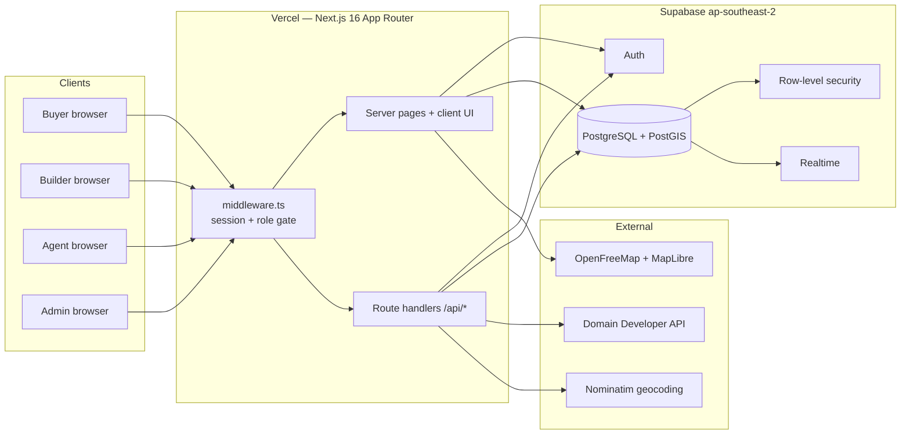
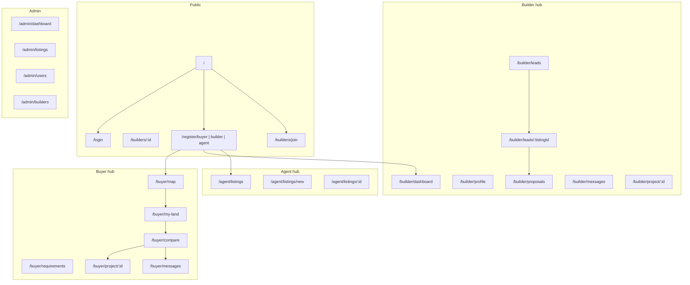
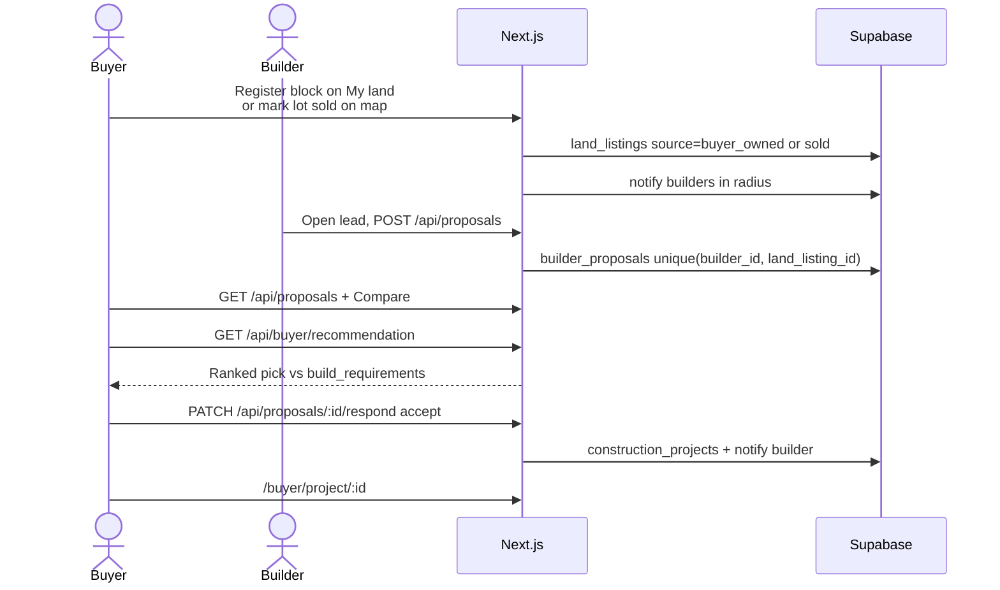
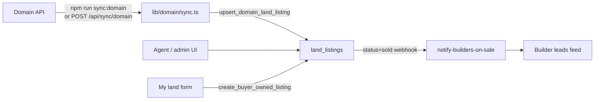
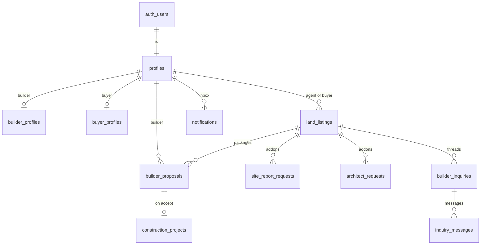
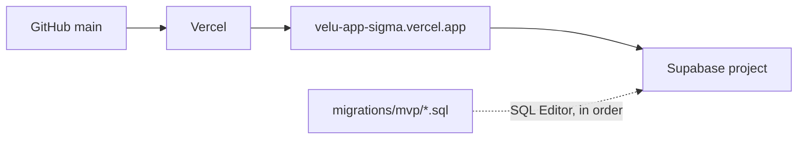

# Velu website architecture

Living blueprint of [velu-app](https://github.com/dealszillame-blip/velu-app) as shipped on `main`. Production: [velu-app-sigma.vercel.app](https://velu-app-sigma.vercel.app).

**What each role can do:** [FEATURES.md](./FEATURES.md).

Velu is a vacant-land marketplace for South West Sydney. Buyers register or buy a block, licensed builders send packages, and the buyer compares, gets a ranked recommendation, and accepts one builder. Agents list land. Admins operate the platform.

---

## 1. System context



| Layer | Choice | Role |
| --- | --- | --- |
| App | Next.js 16, React 19, TypeScript | Pages, layouts, route handlers |
| UI | Tailwind 4, shadcn/ui, Insera-inspired ink/paper theme | Space Grotesk + Roboto Mono |
| Auth + data | Supabase Auth, Postgres, PostGIS, RLS | Identity, listings, proposals, messaging |
| Maps | MapLibre GL + OpenFreeMap | Buyer map (land / builders toggle) |
| Geocoding | OpenStreetMap Nominatim | Address → lat/lng for owned land |
| Listings ingest | Domain Agents & Listings API | Vacant-land sync into `land_listings` |
| Hosting | Vercel | App + preview deploys |

There is no separate backend service. Business rules live in Next.js route handlers, Supabase RPCs, and a small set of `lib/` modules.

---

## 2. Application layers

```
app/
  page.tsx                 Public marketing landing
  (auth)/                  Login, register, verify, password reset
  (buyer)/                 Buyer hub (role-gated)
  (builder)/               Builder hub (role-gated)
  (agent)/                 Agent listings (role-gated)
  (admin)/                 Admin control panel (role-gated)
  onboarding/              Profile creation after first sign-in
  builders/                Public builder directory + join form
  api/                     JSON route handlers
  auth/callback/           Supabase OAuth / email callback
components/                Feature UI (buyer, builder, admin, landing, proposals)
lib/                       Auth, scoring, Domain sync, Supabase clients
migrations/mvp/            Ordered SQL schema (001 → 025)
```

**Request path**

1. `middleware.ts` refreshes the Supabase cookie session.
2. Unauthenticated users hitting `/buyer/*`, `/builder/*`, `/agent/*`, `/admin/*` redirect to `/login?next=…`.
3. Authenticated users on `/` or auth pages redirect to their role home.
4. Cross-role URL access is bounced to that role’s home (admins may enter any gated prefix).
5. Pages call `requireRole()` again. APIs check `profiles.role` themselves. `/api/*` is never redirected to HTML.

Public prefixes: `/`, `/login`, `/register/*`, `/builders/*`, `/builders/join`, `/onboarding/complete` (until a profile exists).

---

## 3. Roles and sitemap

| Role | Home | Shell nav |
| --- | --- | --- |
| Guest | `/` | Landing CTAs only |
| Buyer | `/buyer/map` | Map · My land · Requirements · Compare · Messages |
| Builder | `/builder/dashboard` | Home · Profile · Leads · Proposals · Messages |
| Agent / pending_agent | `/agent/listings` | Listings · New listing |
| Admin | `/admin/dashboard` | Dashboard · Listings · Users · Agent approvals · Builders · Builder interest · Inquiries · Proposals · Settings |



### Buyer surfaces

| Route | What it is |
| --- | --- |
| `/buyer/map` | MapLibre map of vacant lots; Land / Builders toggle |
| `/buyer/my-land` | Register an owned block; site reports; nearby builders; architects; workspace |
| `/buyer/requirements` | Saved brief (beds, baths, storeys, granny flat, measurements) |
| `/buyer/compare` | Pending packages, side-by-side table, **Recommend**, tender report, published designs, upcoming estates |
| `/buyer/messages` | In-app threads with builders (no phone/email shared) |
| `/buyer/project/:id` | Milestone tracker after accept |

### Builder surfaces

| Route | What it is |
| --- | --- |
| `/builder/dashboard` | Leads and proposal snapshot |
| `/builder/profile` | Licence, radius, insurance, public profile |
| `/builder/leads` | Sold / buyer-owned lots in range |
| `/builder/leads/:listingId` | Submit a package (specs, breakdown, inclusions) |
| `/builder/proposals` | Templates and sent packages |
| `/builder/messages` | Threads with buyers |
| `/builder/project/:id` | Shared milestone tracker |

---

## 4. Core journeys

### 4.1 Land → proposal → accept



Rules that shape the product:

- One builder may send **one** proposal per listing (`UNIQUE (builder_id, land_listing_id)`).
- Side-by-side comparison needs **≥ 2** pending/viewed packages.
- Accept creates a `construction_projects` row; do not accept a live demo proposal unless you intend to mutate that buyer’s state.

### 4.2 Recommendation (buyer)

`lib/proposal-recommendation.ts` scores pending packages against `buyer_profiles.build_requirements`:

- Bedroom / bathroom / storey match
- Granny flat / studio (from package name, inclusions, included line items — not from “no granny” notes)
- Price vs cheapest quote
- Programme length
- Premium inclusions and written breakdown

Exposed at `GET /api/buyer/recommendation` and the Compare **Recommend** tab. Deterministic — no external LLM.

### 4.3 Listing ingest



`land_listings.source` is `domain` | `agent` | `buyer_owned`. Map filters: available / under offer / sold.

---

## 5. Data model (core)



| Table | Purpose |
| --- | --- |
| `profiles` | Role, name, company; 1:1 with `auth.users` |
| `buyer_profiles` | `build_requirements` JSON (brief for recommend + tender) |
| `builder_profiles` | Licence, radius, insurance, onboarding |
| `land_listings` | Vacant lots + PostGIS point |
| `builder_proposals` | Package price, specs, breakdown, inclusions, status |
| `builder_proposal_templates` | Reusable builder packages |
| `construction_projects` | Milestone after accept |
| `builder_inquiries` + `inquiry_messages` | In-app chat |
| `site_report_definitions` + `site_report_requests` | Soil report / site survey add-ons |
| `architect_directory` + `architect_requests` | Architect intro requests |
| `builder_published_packages` | Catalogue designs on Compare |
| `builder_compliance_notices` | Fair Trading-style notices on nearby builders |
| `builder_prelaunch_interest` | `/builders/join` waitlist |
| `notifications` | In-app alerts |
| `feature_flags` | Admin-toggled modules |

Enums that drive UX: `user_role`, `listing_status`, `proposal_status`, `construction_milestone`.

Security: RLS on all product tables; route handlers use the user session. Privileged writes (Domain sync, demo seed, some admin lists) use `SUPABASE_SERVICE_ROLE_KEY` via `createServiceClient()`.

---

## 6. API map

APIs are App Router `route.ts` files. They return JSON. Auth is cookie session unless noted.

### Buyer

| Method | Path | Purpose |
| --- | --- | --- |
| GET | `/api/listings` | Map lots |
| GET/POST | `/api/buyer/land` | Owned parcels |
| GET/POST | `/api/buyer/land/:id/site-reports` | Site report add-ons |
| GET/POST | `/api/buyer/land/:id/builders` | Nearby builders |
| GET/POST | `/api/buyer/land/:id/architects` | Architect requests |
| GET/PUT | `/api/buyer/requirements` | Saved brief |
| GET | `/api/buyer/recommendation` | Ranked package pick |
| GET | `/api/buyer/tender-analysis` | Gap report |
| POST | `/api/buyer/demo-proposals` | Seed demo packages (service role) |
| GET | `/api/proposals` | Buyer’s packages |
| PATCH | `/api/proposals/:id/respond` | Accept / decline |
| GET | `/api/workspace/projects` | Active builds |
| GET/POST | `/api/inquiries` | Threads |
| GET/POST | `/api/inquiries/:id/messages` | Messages |

### Builder / shared

| Method | Path | Purpose |
| --- | --- | --- |
| GET | `/api/leads` | In-radius sold / owned lots |
| POST | `/api/proposals` | Submit package |
| GET/POST | `/api/proposals/templates` | Saved templates |
| GET/PUT | `/api/builder/profile` | Builder profile |
| GET | `/api/builders/map` | Builders on the map |
| GET | `/api/builders/:id/profile` | Public profile |
| GET | `/api/builders/published-packages` | Catalogue |
| PATCH | `/api/projects/:id/milestone` | Advance stage |

### Platform / admin / ingest

| Method | Path | Purpose |
| --- | --- | --- |
| POST | `/api/onboarding/{buyer,builder,agent,complete}` | Create `profiles` |
| POST | `/api/builder-interest` | Public join form |
| POST | `/api/sync/domain` | Bearer `DOMAIN_SYNC_SECRET` |
| PATCH | `/api/listings/:id/status` | Mark sold (sync secret) |
| POST | `/api/webhooks/listing-sold` | Supabase DB webhook |
| * | `/api/admin/*` | Listings, users, builders, proposals, flags, inquiries |

---

## 7. Auth and onboarding

```mermaid
flowchart TD
  Start[Register or login] --> CB[/auth/callback]
  CB --> Has{profiles.role?}
  Has -->|no| Onb[/onboarding/complete]
  Onb --> API[POST /api/onboarding/*]
  API --> Home[Role home]
  Has -->|yes| Home
```

- Email/password via Supabase Auth. `user_metadata.intended_role` is set at register.
- `lib/onboarding.ts` writes `profiles` (+ `builder_profiles` for builders).
- Middleware sends users without a profile to `/onboarding/complete`.
- Role homes: buyer → map, builder → dashboard, agent → listings, admin → dashboard.

**Demo accounts** (password `VeluDemo123!`)

| Email | Person | Role |
| --- | --- | --- |
| `demo.buyer2@velu.dev` | Sam Chen | Buyer — Oran Park packages + recommend |
| `demo.buyer@velu.dev` | Alex Morgan | Buyer — Mount Annan |
| `demo.builder@velu.dev` | James Whitfield, Apex Homes | Builder |
| `demo.builder2@velu.dev` | Maria Santos, Meridian | Builder |
| `demo.builder3@velu.dev` | David Nguyen, SouthWest Living | Builder |

---

## 8. UI composition (buyer Compare)

Compare is the product’s “hub after land is secured”:

```
/buyer/compare
  SegmentControl
    Compare        → cards + comparison grid (≥2 packages)
                   → compact Velu recommendation banner
    Recommend      → AiRecommendationPanel
    Tender report  → gap analysis vs brief
    Published designs → catalogue packages
    Upcoming       → coming-soon estates
```

My land parcel cards use the same pattern: **Builders · Architects · Workspace**, plus soil/survey add-ons on the parcel.

---

## 9. Deployment and configuration



Required env (see `docs/SUPABASE_SETUP.md`):

- `NEXT_PUBLIC_SUPABASE_URL`
- `NEXT_PUBLIC_SUPABASE_ANON_KEY`
- `SUPABASE_SERVICE_ROLE_KEY` — admin, Domain sync, demo seed
- Optional: `DOMAIN_CLIENT_ID`, `DOMAIN_CLIENT_SECRET`, `DOMAIN_SYNC_SECRET`

Schema is **not** applied by Vercel. Run `migrations/mvp/` in the Supabase SQL editor (001→025, or `000_all_in_one.sql` plus later files). Buyer hub extras: `023` site reports, `024` architects/packages, `025` demo comparison proposals.

---

## 10. How to extend this blueprint

| If you add… | Update |
| --- | --- |
| A buyer/builder/admin page | Sitemap table + role nav in this doc |
| A table or RPC | Data model + `docs/SUPABASE_SETUP.md` order |
| An API route | API map |
| A third-party | System context |

Source of truth for behaviour is the code on `main`. This file is the map. For a role-by-role list of actions (including what the UI shows but does not do), see [FEATURES.md](./FEATURES.md).
